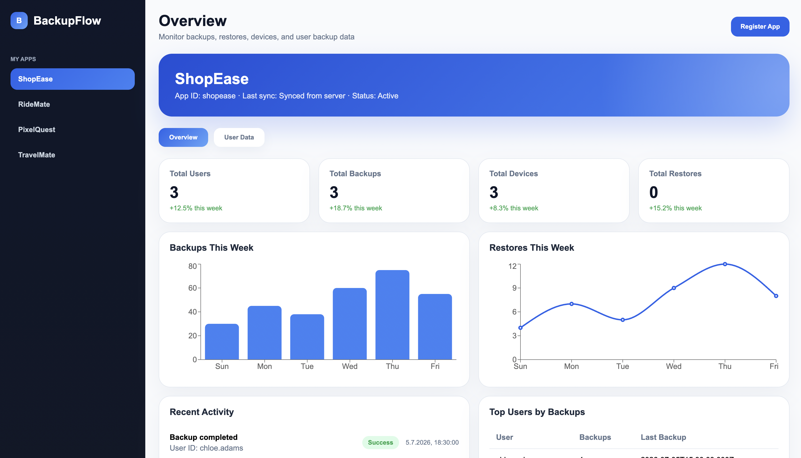
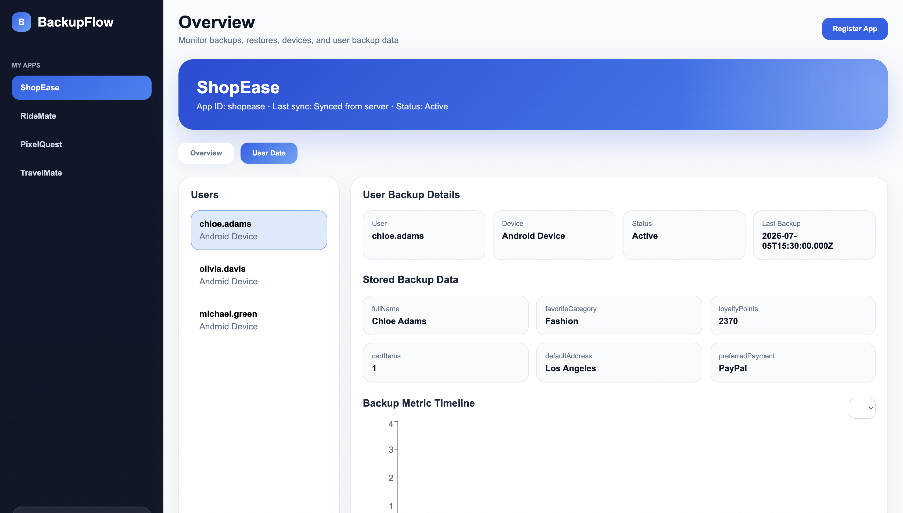
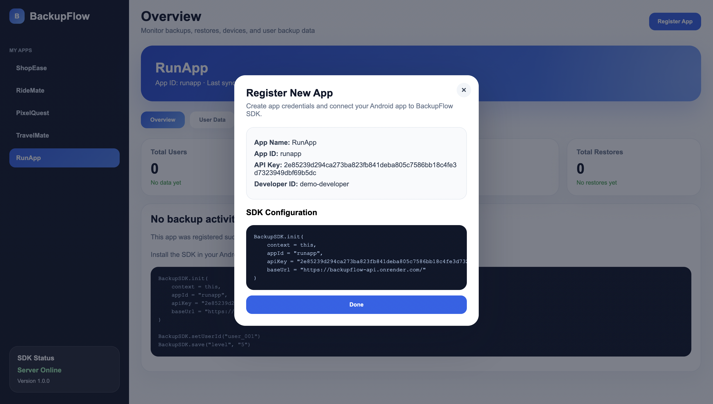

# Developer Portal

The BackupSDK Developer Portal provides a web interface for managing applications and monitoring backup data.

It allows developers to register applications, obtain API credentials, view backup statistics, and inspect user backup data without accessing the database directly.

---

## Features

The Developer Portal provides the following capabilities:

- Register new applications
- Generate an App ID and API Key
- View application statistics
- Monitor recent backup activity
- Browse stored user backup data
- View backup data per registered application

---

## Dashboard Overview

The main dashboard provides a high-level overview of the selected application.

Developers can view backup statistics, application status, and recent backup activity.



---

## User Backup Data

The **User Data** page allows developers to inspect backup information stored for each user.

It displays user identifiers, backup metadata, and the key-value data saved through BackupSDK.



---

## Registering a New Application

Applications can be registered directly from the Developer Portal.

After registration, the portal generates:

- App ID
- API Key

The generated credentials can be used to initialize BackupSDK inside an Android application.



---

## Using the Generated Credentials

Initialize BackupSDK using the generated credentials:

```kotlin
BackupSDK.init(
    context = applicationContext,
    appId = "your-app-id",
    apiKey = "your-api-key",
    baseUrl = "https://your-server-url.com"
)
```

Once initialized, the application is ready to perform backup, restore, and delete operations.